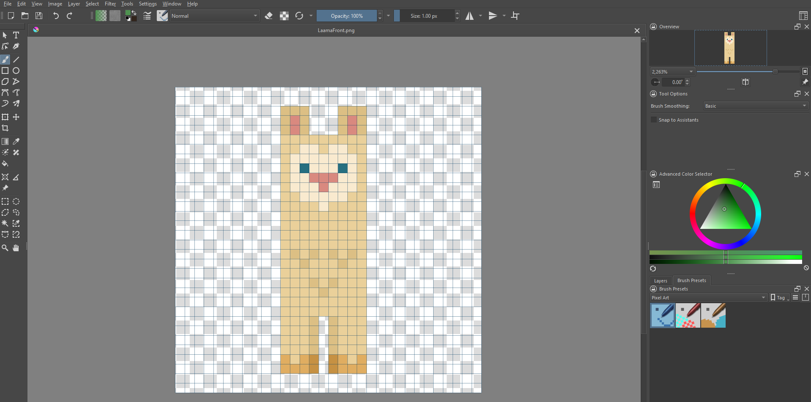
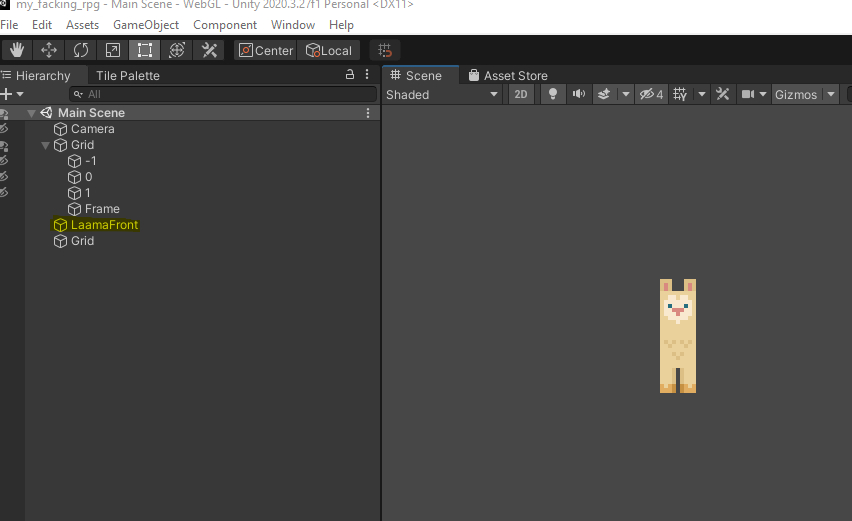
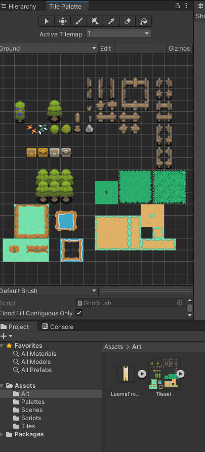
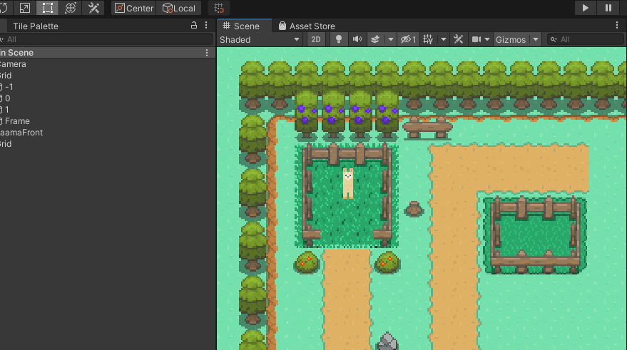
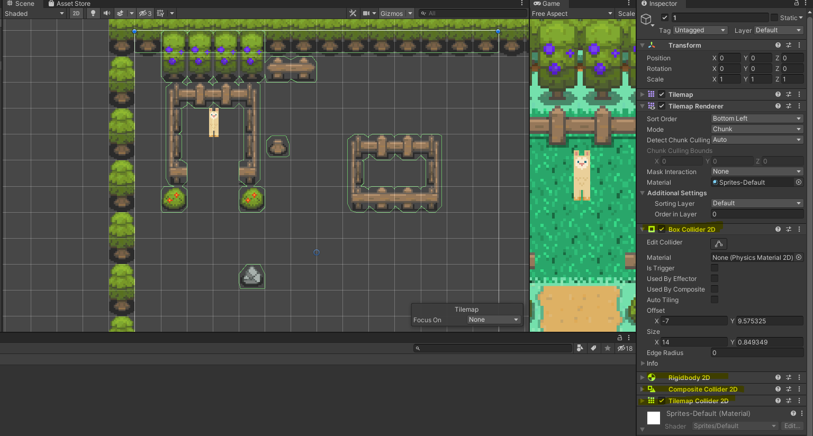
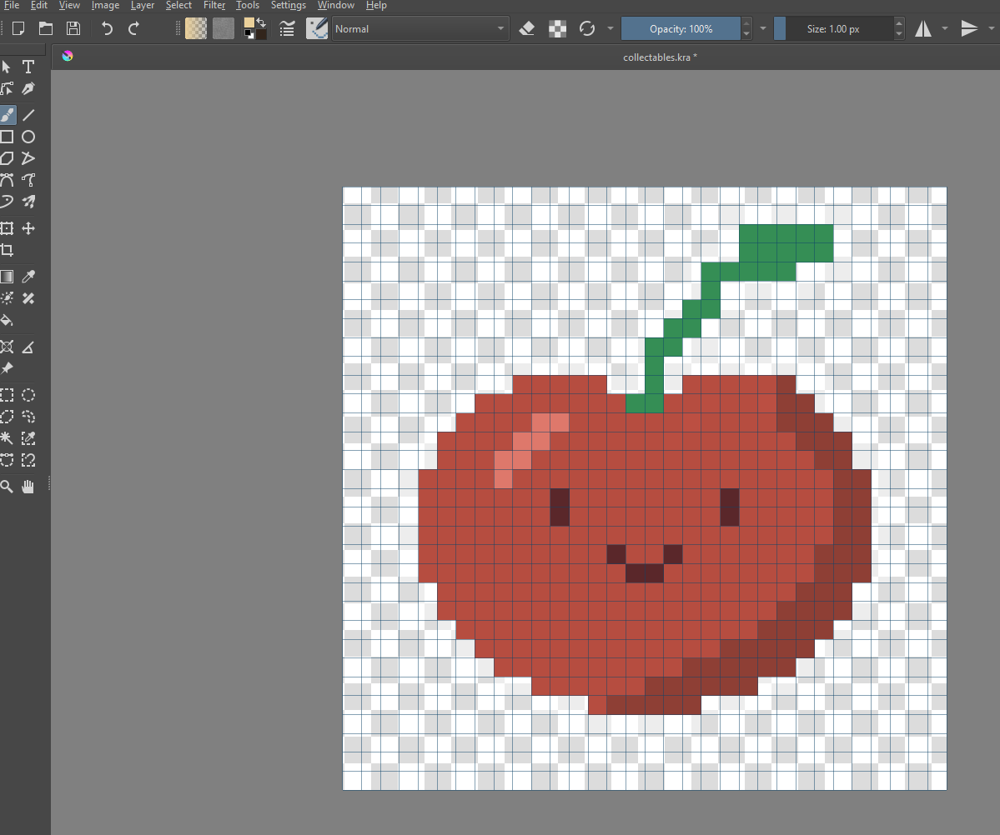

# Lesson: Digital & Serious Games

### First and Last Name: Φαίδρα Δαμιανού
### University Registration Number: dpsd19028

# Introduction
Η εργασία μας είναι η δημιουργία ενός top-down 2d RPG. Διάλεξα ο χαρακτήρας μου να είναι ένα Λάαμα το οποίο το σκάει από το πάρκο και φτήνει περαστικούς.

# Summary
Χρησιμοποίησα το unity engine για την δημιουργία του top-down 2d RPG με pixelart artstyle.

# 1st Deliverable
<ul>Οι στόχοι του πρώτου παραδοτέου ήταν οι εξής.</ul>
<li>1. Αντικατάσταση της Ruby με τον δικο μας πρωταγωνιστή.</ul>
<ul>Δημιουργώντας τον χαρκτήρα μου μέσω του Krita (διαστάσεις 32x32 px) και ακολουθώντας τα βήματα του 
<a href="https://learn.unity.com/tutorial/main-character-and-first-script?uv=2020.3&projectId=5c6166dbedbc2a0021b1bc7c ">tutorial</a> έβαλα στη θέση της Ρούμπι το Λάαμα μου. 
<ul></ul>
<ul></ul>
<ul></ul>
<li>2.Character Controller and Keyboard Input.</li>
<ul>Απλά ακολούθησα το tutorial</ul>
<ul></ul>
<li>3.World Design - Tilemaps.</li>
<ul>Κυρίως με την βοήθεια αυτου του <a href="https://www.youtube.com/watch?v=DTp5zi8_u1U">βίντεο</a> μπόρεσα να βάλω το tilemap και χρησιμοποίησα <a href="https://fikry13.itch.io/another-rpg-tileset">αυτό το tileset</a> του <a href="https://twitter.com/fikry13_">fikry13</a>.</ul>
<ul></ul>
<ul></ul>
<li>4.Decorating the World.</li>
<ul>Έπειτα διακόσμησα σε ένα βαθμό τον χάρτη μου και θα τον βελτιώνω με κάθε παραδοτέο.</ul>
<ul></ul>
<ul>Μετά από δική μου πρωτοβουλία με την βοήθεια αυτού του <a href="https://www.youtube.com/watch?v=2obtqmBHUW4&t=273s">βίντεο</a> σε συνδιασμό με το δεδομένο tutorial έβαλα colliders.</ul>
<ul></ul>
<ul></ul>
<li>5. Build, Run, Distribute.</li>
<ul>Τέλος έκανα build και ανέβασα τα αρχεία μέσω του github desktop</ul>

# 2nd Deliverable
<ul>Οι στόχοι του δεύτερου παραδοτέου ήταν οι εξής.</ul>
<li>1.World Interactions - Blocking Movement.</ul>
<ul>Όπως ανέφερα για τον στόχο 4 στο πρώτο παραδοτέο 1 έβαλα τα colliders</ul>

<li>2.World Interactions - Collectibles.</li>
<ul>Ακολουθώντας το δεδομένο <a href="https://learn.unity.com/tutorial/world-interactions-collectibles?uv=2020.3&projectId=5c6166dbedbc2a0021b1bc7c">tutorial</a> σχεδίασα το sprite του collectable μου και απλά το πρόσθεσα. Δεν αντιμετώπισα κάποιο θέμα</ul>
<ul></ul>

<li>3. World Interactions - Damage Zones and Enemies.</ul>
<ul>Σχεδίασα και πρόσθεσα το κοριτσάκι- ερχθρό με βάση το  <a href="https://learn.unity.com/tutorial/world-interactions-damage-zones-and-enemies?uv=2020.3&projectId=5c6166dbedbc2a0021b1bc7c">tutorial</a> και δεν είχα θέμα ούτε με αυτό</ul>

<li>4.Sprite Animation</ul>
<ul>Εκεί ήταν που άρχισαν τα θέματα μου. Η δημιουργία των animations από μόνο του δεν ήταν δύσκολο, σχεδίασα τα sprites και εκανα τα animations.</ul>
<ul>Η σύνδεση των animations όμως ήταν πιο περίπλοκο από οτι φαινόταν και το δεδομένο tutorial δεν βοηθούσε καθόλου. Με την βοήθεια ενός <a href="https://www.youtube.com/watch?v=hkaysu1Z-N8&t=133s">βίντεο</a> κατάφερα να κάνω το idle animation αλλά τα υπόλοιπα animations δεν μπορύσα να τα συνδέσω.</ul>
<ul>Με την βοήθεια της φίλης μου της Μαριγιάννας μπόρεσα να συνδέσω τα animations και τωρα ο παικτης εχει idle, run & run animations!</ul>
<ul><videocontrols>
  <source src="Animationss.mp4"></video></ul>

<li>6. Camera - Cinemachine. </li>
<ul>Mε την βοήθεια αυτου του <a href="https://www.youtube.com/watch?v=2jTY11Am0Ig&t=51s">βίντεο</a> πρόσθεσα την κάμερα για να ακολουθεί τον παίκτη.</ul>
# 3rd Deliverable 

# Conclusions

# Sources
