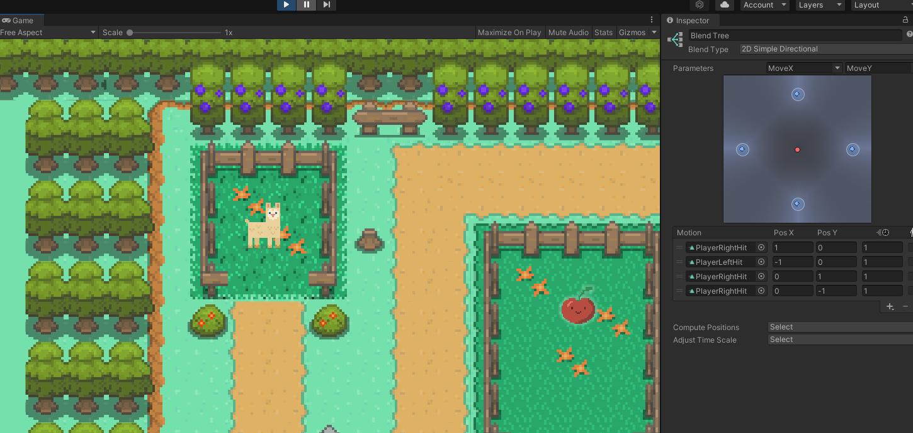
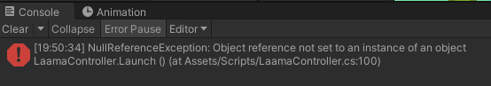
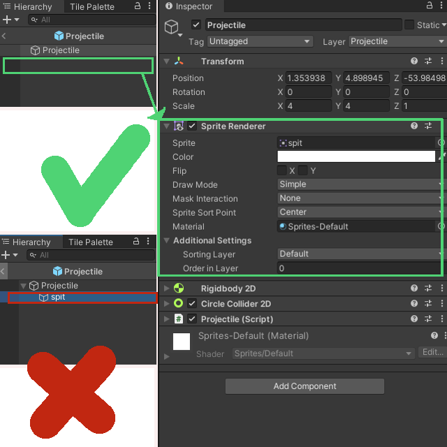
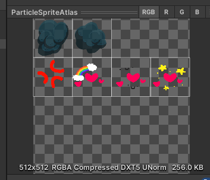
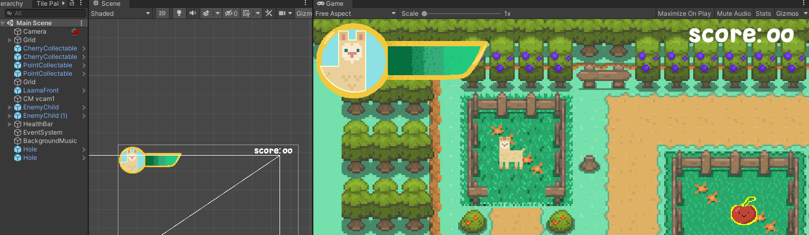
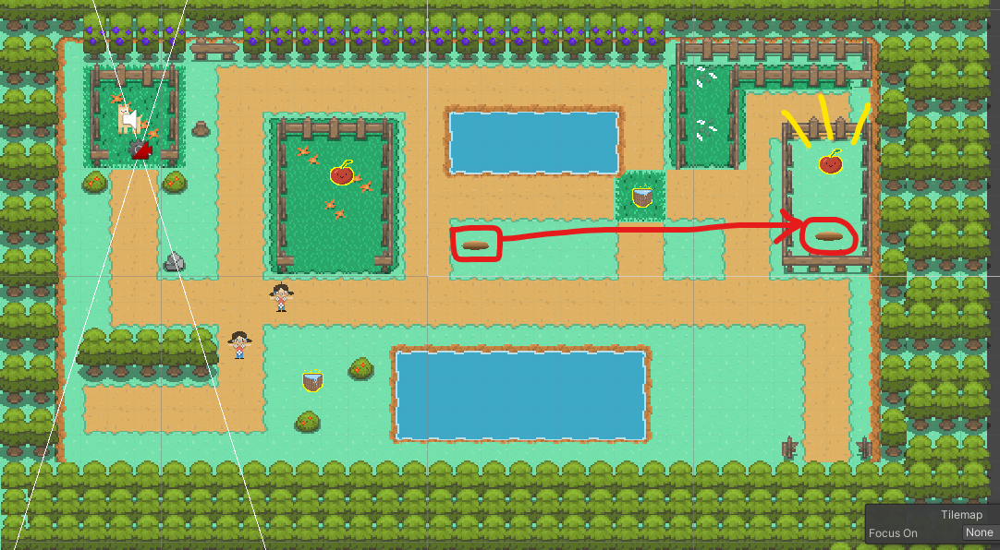
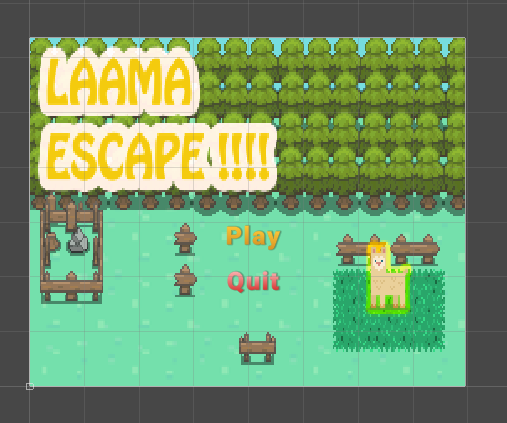

# Lesson: Digital & Serious Games

### First and Last Name: Φαίδρα Δαμιανού
### University Registration Number: dpsd19028

# Introduction
Η εργασία μας είναι η δημιουργία ενός top-down 2d RPG. Διάλεξα ο χαρακτήρας μου να είναι ένα Λάαμα το οποίο το σκάει από το πάρκο και φτήνει περαστικούς.

# Summary
Χρησιμοποίησα το unity engine για την δημιουργία του top-down 2d RPG με pixelart artstyle.

# 1st Deliverable
<ul>Οι στόχοι του πρώτου παραδοτέου ήταν οι εξής.</ul>
<li>1. Αντικατάσταση της Ruby με τον δικο μας πρωταγωνιστή.</ul>
<ul>Δημιουργώντας τον χαρκτήρα μου μέσω του Krita (διαστάσεις 32x32 px) και ακολουθώντας τα βήματα του 
<a href="https://learn.unity.com/tutorial/main-character-and-first-script?uv=2020.3&projectId=5c6166dbedbc2a0021b1bc7c ">tutorial</a> έβαλα στη θέση της Ρούμπι το Λάαμα μου. 
<ul></ul>
<ul></ul>
<ul></ul>
<li>2.Character Controller and Keyboard Input.</li>
<ul>Απλά ακολούθησα το tutorial</ul>
<ul></ul>
<li>3.World Design - Tilemaps.</li>
<ul>Κυρίως με την βοήθεια αυτου του <a href="https://www.youtube.com/watch?v=DTp5zi8_u1U">βίντεο</a> μπόρεσα να βάλω το tilemap και χρησιμοποίησα <a href="https://fikry13.itch.io/another-rpg-tileset">αυτό το tileset</a> του <a href="https://twitter.com/fikry13_">fikry13</a>.</ul>
<ul></ul>
<ul></ul>
<li>4.Decorating the World.</li>
<ul>Έπειτα διακόσμησα σε ένα βαθμό τον χάρτη μου και θα τον βελτιώνω με κάθε παραδοτέο.</ul>
<ul></ul>
<ul>Μετά από δική μου πρωτοβουλία με την βοήθεια αυτού του <a href="https://www.youtube.com/watch?v=2obtqmBHUW4&t=273s">βίντεο</a> σε συνδιασμό με το δεδομένο tutorial έβαλα colliders.</ul>
<ul></ul>
<ul></ul>
<li>5. Build, Run, Distribute.</li>
<ul>Τέλος έκανα build και ανέβασα τα αρχεία μέσω του github desktop</ul>

# 2nd Deliverable
<ul>Οι στόχοι του δεύτερου παραδοτέου ήταν οι εξής.</ul>
<li>1.World Interactions - Blocking Movement.</ul>
<ul>Όπως ανέφερα για τον στόχο 4 στο πρώτο παραδοτέο 1 έβαλα τα colliders</ul>

<li>2.World Interactions - Collectibles.</li>
<ul>Ακολουθώντας το δεδομένο <a href="https://learn.unity.com/tutorial/world-interactions-collectibles?uv=2020.3&projectId=5c6166dbedbc2a0021b1bc7c">tutorial</a> σχεδίασα το sprite του collectable μου και απλά το πρόσθεσα. Δεν αντιμετώπισα κάποιο θέμα</ul>
<ul></ul>

<li>3. World Interactions - Damage Zones and Enemies.</ul>
<ul>Σχεδίασα και πρόσθεσα το κοριτσάκι- ερχθρό με βάση το  <a href="https://learn.unity.com/tutorial/world-interactions-damage-zones-and-enemies?uv=2020.3&projectId=5c6166dbedbc2a0021b1bc7c">tutorial</a> και δεν είχα θέμα ούτε με αυτό. Το μόνο θέμα μου ήταν πως έπρεπε να αλλάξω το speed και να το κανω 1 στο inspector.</ul>

<li>4.Sprite Animation</li>
<ul>Εκεί ήταν που άρχισαν τα θέματα μου. Η δημιουργία των animations από μόνο του δεν ήταν δύσκολο, σχεδίασα τα sprites και εκανα τα animations.</ul>
<ul>Η σύνδεση των animations όμως ήταν πιο περίπλοκο από οτι φαινόταν και το δεδομένο tutorial δεν βοηθούσε καθόλου. Με την βοήθεια ενός <a href="https://www.youtube.com/watch?v=hkaysu1Z-N8&t=133s">βίντεο</a> κατάφερα να κάνω το idle animation αλλά τα υπόλοιπα animations δεν μπορύσα να τα συνδέσω.</ul>
<ul>Με την βοήθεια της φίλης μου της Μαριγιάννας μπόρεσα να συνδέσω τα animations και τωρα ο παικτης εχει idle, run & run <a href="https://www.youtube.com/watch?v=HBsu2_Mnqqk">animations!</a></ul>
<ul>Κάνετε κλικ στο animations για να δειτε ενα βιντεο που τα δείχνει</ul>
<ul></ul>

<li>5.World Interactions - Projectile .</li>
<ul>Δημιούργησα το sprite και το prefab για το projectile αλλά στο script του χαρακτ;hρα δεν εμφανιζόταν τα slot για να κανω drop το projectile, παρόλο που έχω πάρει τον ίδιο κώδικα που δείχνει το δεδομένο tutorial. Χρειάστηκε να φτιάξω νέα scripts για τον παικτη, τον εχθρο και το collectable αλλά ακόμα και έτσι συνεχιζει να βγαίνει το ιδιο error και να κανει pause το παιχνιδι οταν παταω το "C key"</ul>
<ul></ul>
<ul>Κατάλαβα το πρόβλημα μου, Είχα βάλει όλα τα components στο sprite που είχα ενσωματώσει στο prefab ενώ πρέπει το ίδιο το sprite να είναι component του prefab , συγκεκριμενα στο sprite renderer </ul>
<ul></ul>
<li>6. Camera - Cinemachine. </li>
<ul>Mε την βοήθεια αυτου του <a href="https://www.youtube.com/watch?v=2jTY11Am0Ig&t=51s">βίντεο</a> πρόσθεσα την κάμερα για να ακολουθεί τον παίκτη.</ul>

# 3rd Deliverable 
<li>1.Visual Styling - Particles.</li>
<ul>Ακολουθώντας το tutorial τροποποίησα το particle sheet για να ταιράζει με τους εχθρούς , τα χαρουμενα κοριτσάκια</ul>
<ul></ul>

<li>2.Visual Styling - User Interface - Head-Up Display.</li> 
<ul>Με βάση το tutorial έφτιαξα το health display ενώ με την βοήθεια αυτού του <a href="https://www.youtube.com/watch?v=cOW_T3i4_kk">βίντεο</a> έφτιαξα ένα score collectable και ένα score counter</ul>
<ul></ul>

<li>3.World Interactions - Dialog Raycast.</li>
<ul>Με τη βοήθεια αυτού του <a href="https://www.youtube.com/watch?v=evDKHClDxU8">βίντεο</a> κατάφερα να κάνω το teleport αλλά χωρίς το raycast. Όταν ο παίκτης πηγαίνει προς μια τρύπα μεταφέρεται σε ένα άλλο μερος της πίστας με δώρο ένα κεράσι collectable!</ul>
<ul></ul>

<li>4.Audio</li>
<ul>Ακολούθησα το tutorial και μπόρεσα να βαλω ήχο για background για όταν δέχεται ο παίκτης damage,όταν φτήνει και όταν συλλέγει τα collectables (κεράσι και κουβά)</ul>

<li>5.Menu</li>
<ul>Με την βήθεια αυτού του <a href="https://www.youtube.com/watch?v=-GWjA6dixV4">βίντεο</a>Δημιούργησα ένα menu. </ul>
<ul></ul>

# Conclusions

# Sources
